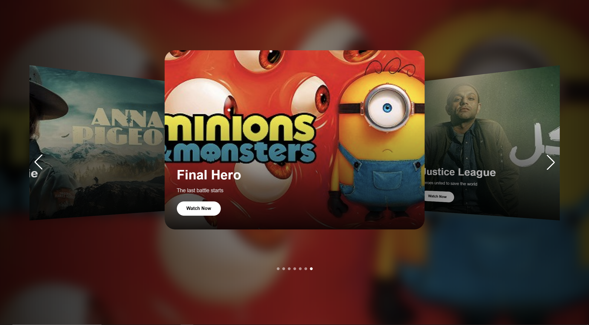

# 🎬 Swiper × GSAP Slider

### A Cinematic & Responsive Slider Built with Swiper, GSAP & Vanilla JavaScript



> A modern cinematic movie slider combining **Swiper's powerful slider engine** with **GSAP animations** to create smooth, dynamic and immersive slide transitions.

---

## 🚀 Live Demo

### 🎥 Try the Slider

**[→ View Live Demo](https://poria-dev.github.io/Slider-With_swiper_Gsap/)**

---

## ✨ Overview

**Swiper × GSAP Slider** is a responsive movie slider built from scratch using **Vanilla JavaScript**, **Swiper.js**, **GSAP**, and a modern responsive UI.

The project combines Swiper's slider functionality with custom GSAP animations to create a more cinematic experience than a standard carousel.

The active movie appears in the center while the surrounding slides remain visible, creating depth and movement between transitions.

---

## 🖼️ Preview


---

## ⚡ Features

* 🎬 Cinematic movie slider
* 🌀 Smooth GSAP transitions
* 🎯 Center-focused active slide
* 🎞️ Layered previous & next slides
* ⬅️ Custom previous navigation
* ➡️ Custom next navigation
* 🔘 Custom pagination indicators
* 🌫️ Animated background
* 🖼️ Dynamic slide images
* 📱 Fully responsive
* 🖥️ Desktop optimized
* 📲 Mobile friendly
* ⚡ Vanilla JavaScript
* 🎨 Modern UI
* 🔥 Swiper + GSAP integration

---

## 🛠️ Tech Stack

| Technology             | Purpose                           |
| ---------------------- | --------------------------------- |
| **HTML5**              | Page structure                    |
| **Tailwind CSS**       | Responsive UI & styling           |
| **Vanilla JavaScript** | Logic & DOM manipulation          |
| **Swiper.js**          | Slider engine & navigation        |
| **GSAP**               | Advanced animations & transitions |

Swiper supports features such as navigation, pagination, looping and touch interactions, while GSAP provides performant JavaScript-based animation capabilities.

---

## 🧠 Architecture

The project separates the responsibilities between the libraries:

```text
                    SLIDER
                       │
          ┌────────────┴────────────┐
          │                         │
       Swiper                      GSAP
          │                         │
          ▼                         ▼
   Slide Management          Visual Animation
   Navigation                Scale
   Pagination                Opacity
   Active Slide              Position
   Touch Control             Transitions
          │                         │
          └────────────┬────────────┘
                       ▼
               Vanilla JavaScript
                       │
                       ▼
                 Final Experience
```

---

## 🎞️ Slider Experience

The slider uses a layered composition instead of simply moving cards from left to right.

```text
┌────────────┐
│            │
│   PREV     │
│            │
└────────────┘

        ┌────────────────────┐
        │                    │
        │    ACTIVE MOVIE    │
        │                    │
        │     WATCH NOW      │
        └────────────────────┘

                          ┌────────────┐
                          │            │
                          │    NEXT    │
                          │            │
                          └────────────┘
```

When the active slide changes, GSAP handles the visual animation while Swiper controls the slide state.

---

## 🎨 Animation System

GSAP is used to make the transitions feel more cinematic instead of relying only on Swiper's default movement.

The animation system can control properties such as:

```text
Opacity
   ↓
Scale
   ↓
Position
   ↓
Transform
   ↓
Background
   ↓
Content
```

This creates a layered transition where the slide doesn't simply move — it **transforms into the next active scene**.

GSAP's core supports tweening, timelines, easing, callbacks and many other animation utilities, making it suitable for this type of custom interaction.

---

## 🔥 Why Swiper + GSAP?

Using only a slider library can give you the basic functionality:

```text
Next
Previous
Pagination
Swipe
Loop
```

But combining it with GSAP makes it possible to build a much more customized visual experience:

```text
Swiper
   +
GSAP
   ↓
Custom Transitions
   ↓
Layered Animations
   ↓
Cinematic Slider
```

This project was built specifically to explore that combination.

---

## 📱 Responsive Design

The slider is designed to adapt to different screen sizes.

### 💻 Desktop

* Large cinematic active card
* Visible neighboring slides
* Full navigation
* Expanded spacing
* Animated background

### 📱 Tablet

* Reduced slide dimensions
* Optimized spacing
* Responsive typography
* Preserved animation experience

### 📲 Mobile

* Smaller active card
* Optimized navigation
* Responsive content
* No unnecessary horizontal overflow
* Touch-friendly interaction

---

## 🧩 Main Components

### Swiper

Responsible for the core slider functionality:

```text
Slide Management
Navigation
Pagination
Active Slide
Touch Interaction
```

Swiper's official setup supports a `.swiper` container, `.swiper-wrapper`, `.swiper-slide`, navigation controls and pagination elements.

### GSAP

Responsible for:

```text
Slide Animations
Scale
Opacity
Position
Transitions
Timing
Easing
```

GSAP is framework-agnostic and can be loaded through npm or a script tag, making it suitable for Vanilla JavaScript projects as well.

### Vanilla JavaScript

Responsible for connecting everything together:

```text
Swiper Events
      ↓
JavaScript Logic
      ↓
GSAP Animation
      ↓
DOM Updates
```

---

## 📂 Project Structure

```text
Slider-With_swiper_Gsap/
│
├── img/
│   ├── movie images
│   └── background images
│
├── src/
│   ├── index.html
│   ├── style.css
│   └── app.js
│
├── swiperssliderimg.png
│
└── README.md
```

---

## 🚀 Getting Started

### 1. Clone the repository

```bash
git clone https://github.com/poria-dev/Slider-With_swiper_Gsap.git
```

### 2. Enter the project

```bash
cd Slider-With_swiper_Gsap
```

### 3. Run the project

Open the HTML file in your browser.

If you are using a local development server, simply start the server and open the project in your browser.

---

## 📦 Libraries

### Swiper

Swiper can be installed through npm or loaded from a CDN. The current official documentation provides both approaches.

```bash
npm install swiper
```

### GSAP

GSAP can also be installed through npm or loaded directly into a webpage.

```bash
npm install gsap
```

---

## 🎯 What I Learned

This project helped me practice combining third-party libraries with my own JavaScript logic instead of depending entirely on a library's default behavior.

### Main concepts practiced:

* Swiper configuration
* Swiper events
* Navigation
* Pagination
* Active slide detection
* GSAP animations
* Animation timing
* Easing
* DOM manipulation
* Responsive design
* Tailwind CSS
* Vanilla JavaScript
* Library integration
* Creating custom slider experiences

---

## 💡 Development Concept

The main idea was simple:

> **Don't let the library define the entire design.**

Swiper handles the difficult slider mechanics.

GSAP handles the animation system.

Vanilla JavaScript connects everything.

Tailwind handles the responsive UI.

```text
┌──────────────────┐
│      SWIPER      │
│  Slider Engine   │
└────────┬─────────┘
         │
         ▼
┌──────────────────┐
│      GSAP        │
│ Animation Engine │
└────────┬─────────┘
         │
         ▼
┌──────────────────┐
│ VANILLA JAVASCRIPT│
│   Custom Logic   │
└────────┬─────────┘
         │
         ▼
┌──────────────────┐
│   TAILWIND CSS   │
│ Responsive UI    │
└──────────────────┘
```

---

## 🔮 Future Improvements

* [ ] Auto-play
* [ ] Keyboard navigation
* [ ] Touch gesture improvements
* [ ] More advanced GSAP transitions
* [ ] Parallax effects
* [ ] 3D slide transitions
* [ ] Dynamic movie data
* [ ] Movie details modal
* [ ] Trailer integration
* [ ] Loading animations
* [ ] Accessibility improvements

---

## 🌟 Project Goal

The goal of this project wasn't simply to create another movie carousel.

It was to experiment with:

**Swiper + GSAP + Vanilla JavaScript**

and understand how powerful libraries can be combined with custom JavaScript logic to create a unique interface.

---

## 👨‍💻 Developer

### Pooria Rezaee

Frontend Developer focused on creating:

* Interactive Web Experiences
* Modern UI
* JavaScript Animations
* Parallax Effects
* Sliders & Carousels
* Responsive Websites

---

## ⭐ Support

If you like this project, consider giving the repository a **star ⭐**

It helps support the project and motivates me to build more creative frontend experiments.

---

<div align="center">

# 🎬 Swiper × GSAP

### Built with Vanilla JavaScript • Swiper • GSAP • Tailwind CSS

**[🚀 Live Demo](https://poria-dev.github.io/Slider-With_swiper_Gsap/)**

⭐ **Star the repository if you like it!**

</div>

